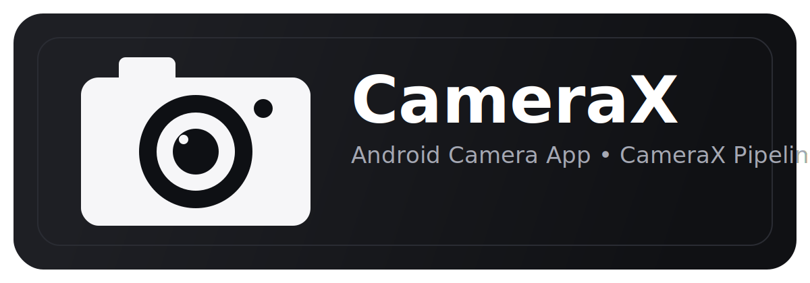

# CameraX (Android)

This project is a lightweight open-source Android camera app built with CameraX and a gyroscope-assisted lock mode.

## Features

- Splash screen with custom CameraX logo
- Live camera preview
- Video recording (saved to gallery)
- `Gyro Lock` button above record button
- When Gyro Lock is enabled, recording locks video output orientation at start so output remains in one direction

## How Gyro Lock Works

- `Gyro Lock: OFF`: orientation follows normal device rotation behavior
- `Gyro Lock: ON`: at record start, app samples device orientation from rotation-vector sensor and locks target rotation for that clip

## Build

Open this folder in Android Studio (Hedgehog or newer), let Gradle sync, and run on a device with camera and gyro.

## Download APK

- Repository: https://github.com/Densuper/CameraX
- Release: https://github.com/Densuper/CameraX/releases/tag/v1.0
- Direct APK: https://github.com/Densuper/CameraX/releases/download/v1.0/app-debug.apk

## Notes

- This implementation locks output orientation per clip; it does not apply full per-frame re-warp stabilization.
- For advanced horizon-lock and cinematic stabilization, extend pipeline with custom GL frame transforms.
